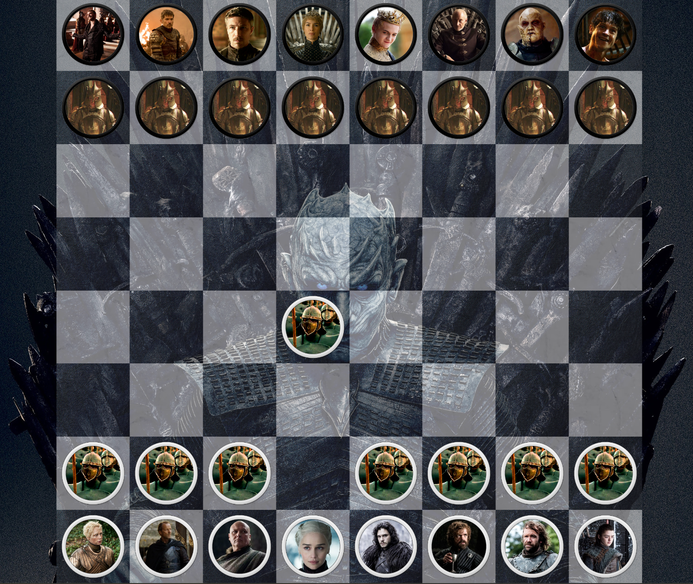

# Game Of Thrones Chess

Built using Typescript, React, Tailwind and Vite.

I also used Photoshop for the pieces, and Audacity to create the mp3s.

All images and audio clips used in this project are for research/educational purposes only and this is not a commercial project.

## Instructions

1. Clone the repository
2. run ``npm i``
3. run ``npm run dev``
4. Enjoy